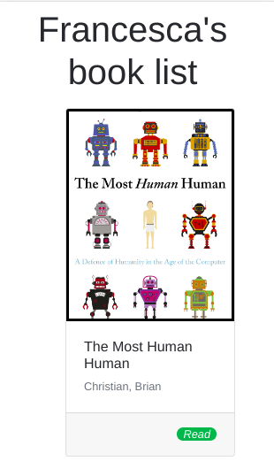

# Die Bücherliste
Erstellen Sie eine personalisierte Buch-Website! Anstatt alle Details der Bücher in HTML hinzuzufügen, fügen Sie die Daten auf der Seite aus dem Array `books` in `index.js` mit JavaScript hinzu.

## Buchdetails
Stellt die Buchdetails auf der Seite dar, z. B. den Namen des Autors, den Buchtitel und den Lesestatus. Das Buchcover sollte oberhalb der Buchdetails erscheinen und das Bild sollte auf die URL des Buchcovers verweisen.

## Status
Das Styling des Lesestatus sollte aktualisiert werden, je nachdem, ob das Buch gelesen wurde (siehe `alreadyRead` Wert im Buchobjekt). Der Bootstrap-Badge-Stil sollte entsprechend angepasst sein, ebenso wie der Text, der als "Gelesen" erscheinen sollte.

## Reihenfolge
Die Nachnamen der Autoren sollten zuerst erscheinen, z. B. "Smith, John". Außerdem sollten die Bücher auf der Seite in alphabetischer Reihenfolge nach den Nachnamen der Autoren angezeigt werden.

**Bilder**:

**Anmerkungen**:
* Deadline: 2h.
* Arbeitet mit den Dateien "index.html" und "index.js", die in diesem Repository zur Verfügung gestellt werden.
* Fügen Sie Bootstrap-Styling hinzu, wo nötig. Siehe die Referenzbilder für das Ergebnis.
